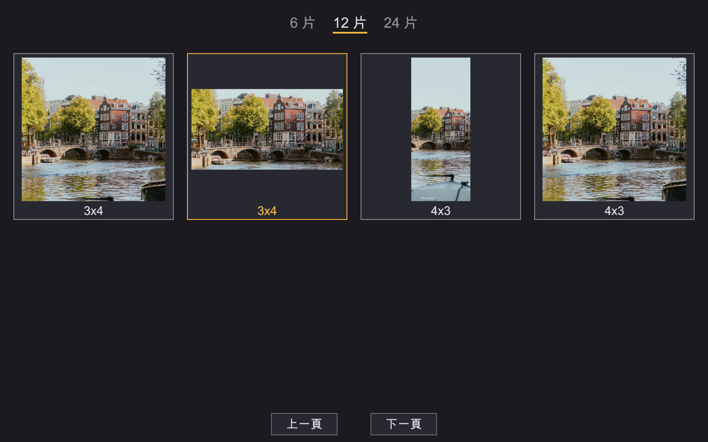
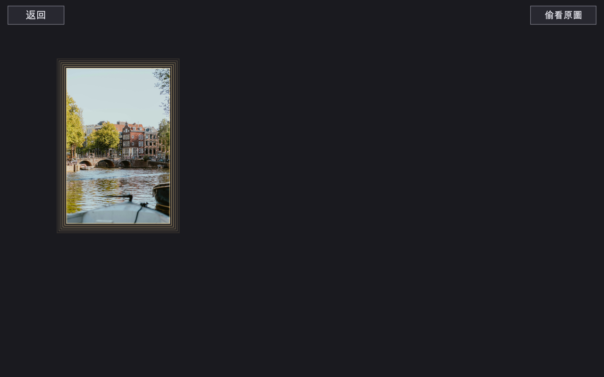
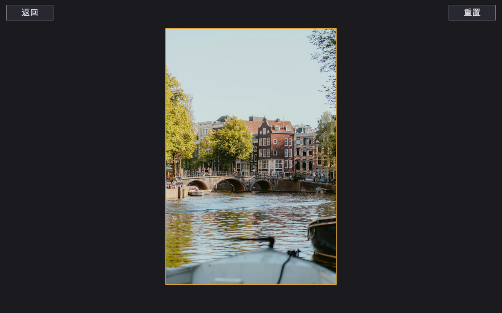

# puzzle

一個本機拼圖小遊戲。遊戲本身不附任何素材——你把自己的圖片丟進來源資料夾，它就變成拼圖。

為什麼這樣做：一般拼圖遊戲的內容量是開發者的負擔，關卡畫完就沒了。這裡把「內容」
整個交給玩家，關卡數量等於你有多少張想看的圖。連難度也不用選單——直接寫在資料夾
名稱上，`3_4` 就是切成 3 列 4 行。整理資料夾這件事本身就是在編關卡。

- 玩家自備圖片，資料夾結構即關卡定義
- 真拼圖的玩法：拼片散落桌面、自由拖曳、相鄰的自動扣合成組
- 依難度（拼片總數）分區的選圖畫面，完成的圖標成琥珀色
- 只記錄哪些拼完了，不存半途進度
- 純本機，不連網、不上傳任何東西

---

## 怎麼放圖

```
images/<圖集>/<高_寬>/圖片檔
```

例如 `images/山景/6_4/canal.jpg` 就是把這張圖切成 6 列 4 行、共 24 片。

- `<高_寬>` 用**底線**分隔，**列數在前、行數在後**。注意這跟一般講圖片尺寸的習慣
  （寬在前，如 1920x1080）是相反的
- `<圖集>` 那層隨你取名，只用來分類檔案，遊戲畫面上不會出現
- 同一張圖放在不同的 `<高_寬>` 底下就是兩個不同的關卡，進度分開算
- `<高_寬>` 那層寫錯（例如 `images/山景/亂寫/`）就整個不讀，不提示也不給預設值
- 開遊戲時掃一次。中途丟新圖進去要重開才看得到

一個關卡都沒掃到時，遊戲不會只丟一句「找不到」，而是直接把上面這套規則、
以及它實際在找哪個路徑，印在畫面上。

## 怎麼玩

### 選圖



依**難度**分區，難度就是拼片總數。最上面那排列出所有存在的難度，目前這個底下有
琥珀色底線，點其他的可以直接跳過去——沒有這排的話，玩家不會發現別的難度還有圖。

每頁四格，格子裡是完整原圖加上「幾乘幾」（所以同一區裡的 `3_4` 和 `4_3` 分得出來）。
**已完成的圖邊框和文字都是琥珀色**，點進去是欣賞而不是重玩。

### 拼

沒有板子，整個畫面就是一張桌子。

- 拼片一開始隨便散，**可以互相重疊**、疊成一堆——真拼圖本來就這樣
- 滑鼠移過去，抓得起來的東西會亮邊框。已經扣成一組的會**整組**亮起來，
  因為那才是按下去會動到的範圍
- 相鄰的兩片靠得夠近就自動扣住，之後**一起移動，而且不能再拆開**
- 拼片**不能旋轉**
- 右上角「偷看原圖」滑過去會蓋一張原圖上來當參考
- 左上角「返回」等於棄權，拼到一半的進度不留

### 完成



所有片併成一組時，圖的周圍會有琥珀色金光閃三次、約五秒。
**存檔發生在最後一片扣上的那一瞬間**，不是等金光放完——所以閃爍途中關掉視窗也算數。



金光結束後轉成欣賞畫面。這個畫面有兩個入口：剛拼完，以及從選圖畫面點已完成的圖。
右上角的「重置」會清掉完成紀錄並立刻重拼一次。

---

## 架構

```
scan      images/<圖集>/<高_寬>/圖片檔
            -> Vec<Entry>   一張圖 x 一種切法 = 一個關卡，依片數排序

畫面      Select  選圖：難度分區、翻頁、完成標示
            -> Board   拼圖：散落、拖曳、互吸、群組、金光
            -> View    欣賞：看完整的圖、重置

存檔      Completed  <來源資料夾>.completed
            <- Board 完成的瞬間寫入
            -> Select 決定哪些格子是琥珀色
```

| 檔案 | 負責 |
|------|------|
| `src/scan.rs` | 掃描來源資料夾、解析 `<高_寬>`、依片數排序 |
| `src/select.rs` | 選圖畫面：難度總覽、翻頁、完成標示、找不到關卡時的設定說明 |
| `src/board.rs` | 拼圖本體：散落、拖曳、互吸、群組、完成金光 |
| `src/view.rs` | 欣賞畫面與重置 |
| `src/assets.rs` | 圖片載入、縮圖、texture 快取 |
| `src/save.rs` | 完成紀錄的讀寫 |
| `src/ui.rs` | 配色、字型、按鈕 |

## 幾個關鍵設計決定

**拼片不是真的切開。** 一個關卡只有一張 texture，每片畫的時候指定自己的來源矩形。
所以 48 片和 4 片的記憶體用量一樣，切法改變也不需要重新處理圖片。

**不能旋轉，所以吸附只是位置比對。** 兩片該不該扣起來，就看它們在畫面上的位置差
是不是接近格子的位移；低於容許誤差就對齊、扣上。允許旋轉的話這裡要多一整層角度
比對，而且玩家每片要試四個方向，休閒向的拼圖不值得這個代價。

**扣起來不能拆，所以群組只需要合併、不需要分裂。** 這讓 union-find 剛好夠用——
併查集天生只合併不分裂，如果允許拆開就得換資料結構或每次重算。這個規則對玩家也
沒有代價：拼片只有在**真的是鄰居**時才會扣起來，不可能扣錯，所以不能反悔沒差。

**完成的瞬間就寫檔，不等動畫。** 原本是金光放完才存，結果玩家在閃爍途中按返回或
關視窗，那一次就白拼了。動畫是表演，存檔是事實，兩者不該綁在一起。

**HUD 只擋「開始拖曳」，不擋「放開滑鼠」。** 一開始兩者都擋，導致放手時游標剛好
落在返回鍵或偷看區上面的話，那一次放開會被整個忽略——最後一片永遠扣不上。

**選圖畫面一定要有難度總覽。** 早期只有翻頁按鈕，結果只有一個關卡的難度會獨佔一頁，
玩家開起來停在第一頁，完全不知道後面還有東西，會誤以為存檔壞掉。

**存檔只記完成，不記半途。** 進度檔因此就是一個純文字清單，一行一個關卡，
沒有序列化格式要維護、也沒有版本相容問題。代價是中途離開就重來。

## 限制

- 桌面是固定視窗，**不能縮放平移**。片數大約超過 48 片會很擠——這是刻意的取捨，
  設定上就是小遊戲
- 拼片是長方形，**沒有傳統拼圖的凸凹邊**
- 換了資料夾名稱或檔名，那筆完成紀錄就對不上，會變回沒拼過
  （關卡的身分就是「路徑 + 切法」）
- 沒有音效
- 直式照片在畫面上會偏小，因為整張圖被限制在畫面寬高各 45% 以內
- 介面中文字依賴 macOS 內建的 `Arial Unicode.ttf`，找不到就自動退回英文

## 素材授權

`docs/` 底下的截圖用的是 Unsplash 的免費授權照片（攝影 Alin Gavriliuc），
不是遊戲內附的素材——遊戲本身不含任何圖片。

安裝與指令請看 [README](README.md)。
